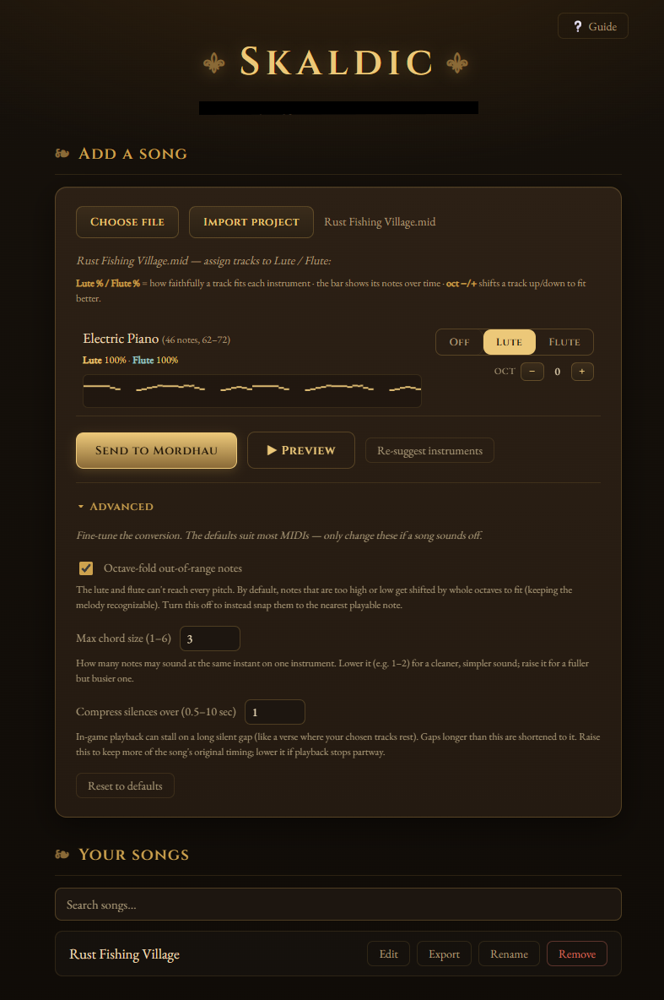

# Skaldic

Turn any MIDI into music you can perform in **Mordhau** — automatically arranged across the lute and flute.

[](https://github.com/HendoBuilds/skaldic/releases/latest)
[](https://github.com/HendoBuilds/skaldic/releases)
[](LICENSE)
[](https://tauri.app)
[](https://github.com/HendoBuilds/skaldic/releases/latest)



## What it does

Skaldic converts a `.mid` file into a Mordhau song you can play in-game. It auto-assigns your MIDI's tracks across the lute and flute, lets you tune the arrangement (range fit, octave shifts, a piano-roll view, an audio preview), and writes it straight into Mordhau so the LuteMod mod can perform it.

## Requirements

- **Mordhau**, installed and launched at least once.
- **LuteMod** — the in-game mod that actually performs the songs. Skaldic *prepares* the music; LuteMod *plays* it.

LuteMod isn't bundled with Skaldic; you install it once, either way below.

**Manually (no other apps needed)** — download [LuteMod](https://mod.io/g/mordhau/m/lutemod) and the [Clientside Mod Autoloader](https://mod.io/g/mordhau/m/clientside-mod-autoloader) (plus its [Clientside Skin Module](https://mod.io/g/mordhau/m/clientside-skin-loader-map) prerequisite) from mod.io. Drop the `.pak` files into Mordhau's `Content\CustomPaks` folder (next to the existing `Paks` folder), then add LuteMod to `Game.ini` at `%LocalAppData%\Mordhau\Saved\Config\WindowsClient\Game.ini`:

```ini
[/Game/Mordhau/Maps/ClientModMap/BP_ClientModLoaderActor.BP_ClientModLoaderActor_C]
ClientMods=/Game/Mordhau/Maps/LuteMod/Client/BP_LuteModClientLoader.BP_LuteModClientLoader_C
```

The mod.io pages are the source of truth if Mordhau's mod loading changes in a patch.

**Via LuteBot** — [LuteBot](https://github.com/Dimencia/LuteBot3)'s installer sets LuteMod up for you. Easiest if you already use it, or have installed LuteMod through it before.

## Install

Download the latest `Skaldic_x.y.z_x64-setup.exe` from the [**Releases**](https://github.com/HendoBuilds/skaldic/releases/latest) page and run it. Windows SmartScreen may warn that the publisher is unknown (the build is unsigned) — choose **More info → Run anyway**. Or build from source (below).

Skaldic uses [SignPath Foundation](https://signpath.org/) for code signing of its Windows installers (certificate application in progress): see the [code signing policy](docs/CODE_SIGNING_POLICY.md), which also covers the project's privacy practices.

From v0.2.0 on, Skaldic checks for new versions when it starts and offers to update in place — your songs and saved projects are kept. Updates are cryptographically signed and verified before they install. (v0.1.0 predates this: update from it by downloading the new installer once and running it over your install.)

## Using it

1. **Choose** a `.mid` file — or drag one onto the panel.
2. Skaldic **auto-assigns tracks**: backing parts stack on the **Lute**, the lead line goes to the **Flute**. Adjust any track with its dropdown.
3. The **Lute % / Flute %** show how well each track fits an instrument; use **oct −/+** to shift a track into range.
4. **▶ Preview** for a rough idea of the arrangement (it won't sound exactly like Mordhau's instruments), then **Send to Mordhau**.

### Playing it in-game

With an instrument equipped, LuteMod uses your Mordhau keybinds:

- **Kick** — open the song menu (and page forward)
- **Arrow Left / Right** — page through the menu
- **Equipment Select (0–9)** — pick a song
- **Feint** — play / pause
- **Num Pad 1** — toggle Voice mode (plays the notes as character shouts)

## Build from source

Requires Node 20+ and the Rust toolchain (see [Tauri prerequisites](https://tauri.app/start/prerequisites/)).

```sh
npm install
npm run tauri dev     # run in development
npm run tauri build   # produce a Windows installer
npm test              # run the test suite
```

## How it works

Skaldic converts the MIDI into a LuteMod "partition" and writes it into Mordhau's `SaveGames` folder as a save file; the LuteMod game mod reads and performs it. Your editable projects (the source MIDI plus your settings) are kept separately in Skaldic's own app-data folder, so your songs and edits survive reinstalls.

## Bugs & feedback

Found a bug or have a specific request? [Open an issue](https://github.com/HendoBuilds/skaldic/issues). For questions, setup help, or to show off your songs, head to [Discussions](https://github.com/HendoBuilds/skaldic/discussions).

## Credits & license

Skaldic is MIT-licensed (see [`LICENSE`](LICENSE)). It's an independent rebuild that stands on the Mordhau bard community's work — see [`NOTICE.md`](NOTICE.md) for acknowledgments (Monty, Dimencia, cswic, Bardlord) and third-party licenses.

Skaldic is an unofficial, fan-made tool. It is not affiliated with or endorsed by Triternion or Mordhau.
